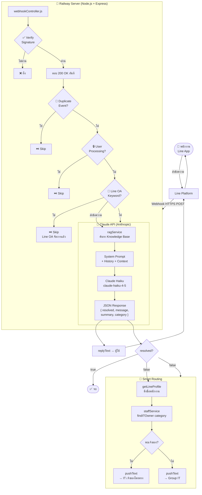
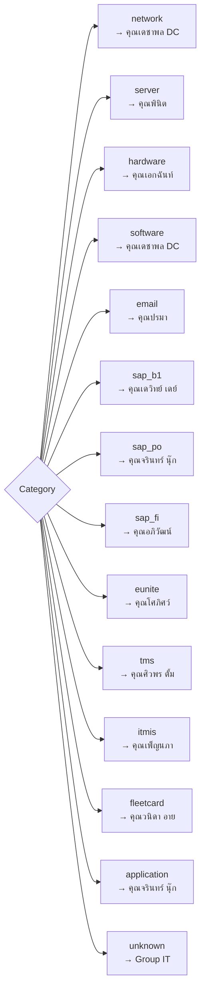
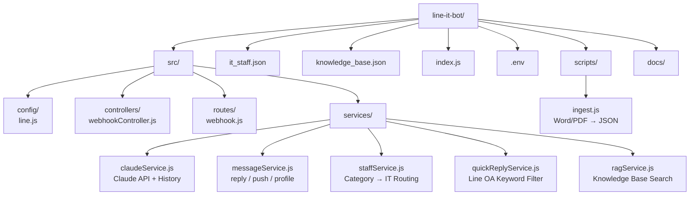
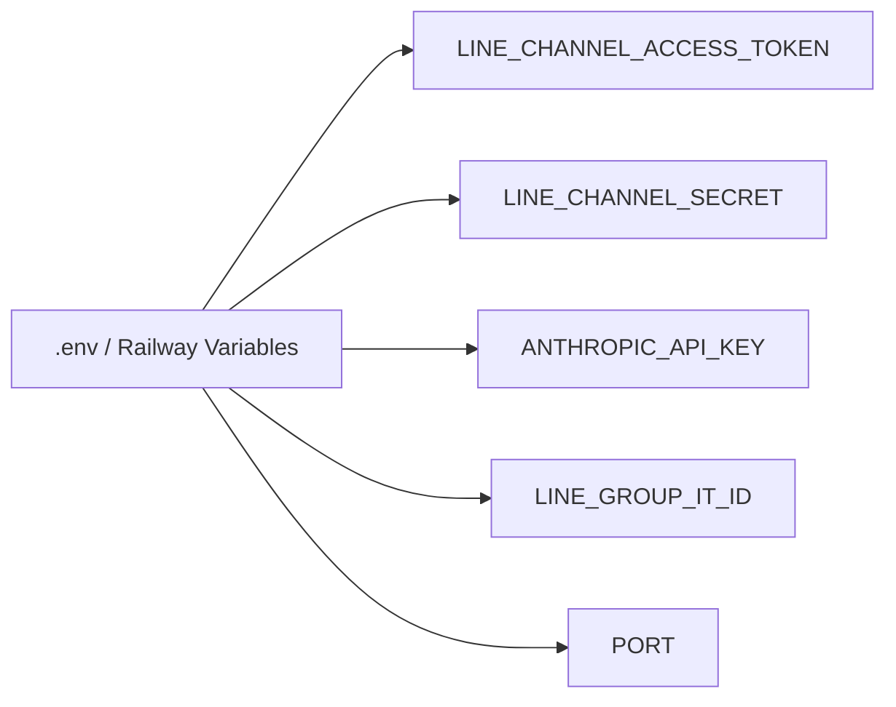

# Line IT Bot — System Diagram

## Flow หลัก

```mermaid
flowchart TD
    U([👤 พนักงาน\nLine App]) -->|ส่งข้อความ| LP[Line Platform]
    LP -->|Webhook HTTPS POST| RW

    subgraph RW["🚂 Railway Server (Node.js + Express)"]
        direction TB
        W[webhookController.js] --> SIG{✅ Verify\nSignature}
        SIG -->|ไม่ผ่าน| X1[❌ ทิ้ง]
        SIG -->|ผ่าน| R200[ตอบ 200 OK ทันที]
        R200 --> DUP{🔁 Duplicate\nEvent?}
        DUP -->|ใช่| X2[⏭️ Skip]
        DUP -->|ไม่| LOCK{🔒 User\nProcessing?}
        LOCK -->|ใช่| X3[⏭️ Skip]
        LOCK -->|ไม่| KW{🔑 Line OA\nKeyword?}
        KW -->|ใช่| X4[⏭️ Skip\nLine OA จัดการแล้ว]
        KW -->|ไม่| CL
    end

    subgraph CL["🤖 Claude API (Anthropic)"]
        direction TB
        RAG[ragService\nค้นหา Knowledge Base] --> PROMPT[System Prompt\n+ History + Context]
        PROMPT --> AI[Claude Haiku\nclaude-haiku-4-5]
        AI --> JSON["JSON Response\n{ resolved, message,\n  summary, category }"]
    end

    KW -->|ส่งข้อความ| RAG
    JSON --> REPLY[replyText → ผู้ใช้]
    REPLY --> LP
    LP --> U

    JSON --> RES{resolved?}
    RES -->|true| DONE([✅ จบ])
    RES -->|false| ROUTE

    subgraph ROUTE["📡 Smart Routing"]
        direction TB
        PROF[getLineProfile\nดึงชื่อพนักงาน] --> FIND[staffService\nfindITOwner category]
        FIND --> OWN{พบเจ้าของ?}
        OWN -->|ใช่| PUSH1[pushText\n→ IT เจ้าของโดยตรง]
        OWN -->|ไม่| PUSH2[pushText\n→ Group IT]
    end

    RES -->|false| PROF
```

---

## Smart Routing — Category → IT เจ้าของ

```mermaid
flowchart LR
    CAT{Category} --> N[network\n→ คุณเดชาพล DC]
    CAT --> S[server\n→ คุณพินิต]
    CAT --> H[hardware\n→ คุณเอกฉันท์]
    CAT --> SW[software\n→ คุณเดชาพล DC]
    CAT --> EM[email\n→ คุณปรมา]
    CAT --> SB[sap_b1\n→ คุณเดวิทย์ เดย์]
    CAT --> SP[sap_po\n→ คุณจรินทร์ นุ๊ก]
    CAT --> SF[sap_fi\n→ คุณอภิวัฒน์]
    CAT --> EU[eunite\n→ คุณโศภิศว์]
    CAT --> TM[tms\n→ คุณศิวพร ตั้ม]
    CAT --> IT[itmis\n→ คุณเพ็ญนภา]
    CAT --> FC[fleetcard\n→ คุณวนิดา อาย]
    CAT --> AP[application\n→ คุณจรินทร์ นุ๊ก]
    CAT --> UK[unknown\n→ Group IT]
```

---

## โครงสร้างไฟล์

```mermaid
graph TD
    ROOT[line-it-bot/] --> SRC[src/]
    ROOT --> IT[it_staff.json]
    ROOT --> KB[knowledge_base.json]
    ROOT --> IDX[index.js]
    ROOT --> ENV[.env]
    ROOT --> SCR[scripts/]
    ROOT --> DOC[docs/]

    SRC --> CFG[config/\nline.js]
    SRC --> CTL[controllers/\nwebhookController.js]
    SRC --> RTE[routes/\nwebhook.js]
    SRC --> SVC[services/]

    SVC --> CS[claudeService.js\nClaude API + History]
    SVC --> MS[messageService.js\nreply / push / profile]
    SVC --> SS[staffService.js\nCategory → IT Routing]
    SVC --> QS[quickReplyService.js\nLine OA Keyword Filter]
    SVC --> RS[ragService.js\nKnowledge Base Search]

    SCR --> ING[ingest.js\nWord/PDF → JSON]
```

---

## Environment Variables

```mermaid
graph LR
    ENV[.env / Railway Variables] --> T[LINE_CHANNEL_ACCESS_TOKEN]
    ENV --> S[LINE_CHANNEL_SECRET]
    ENV --> A[ANTHROPIC_API_KEY]
    ENV --> G[LINE_GROUP_IT_ID]
    ENV --> P[PORT]
```
